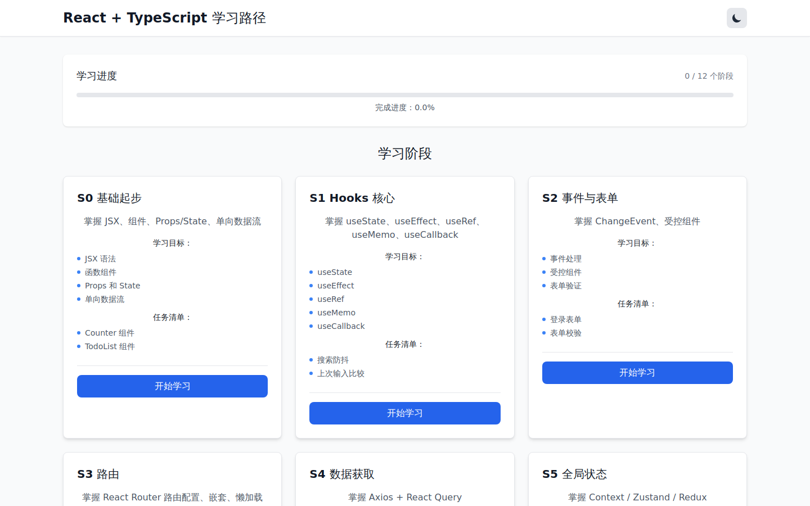
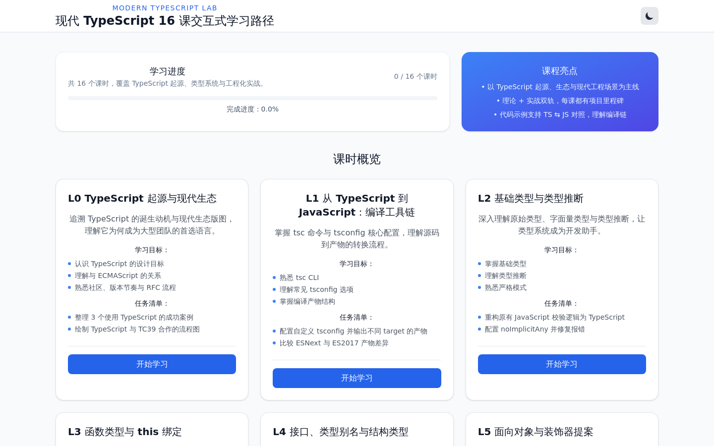
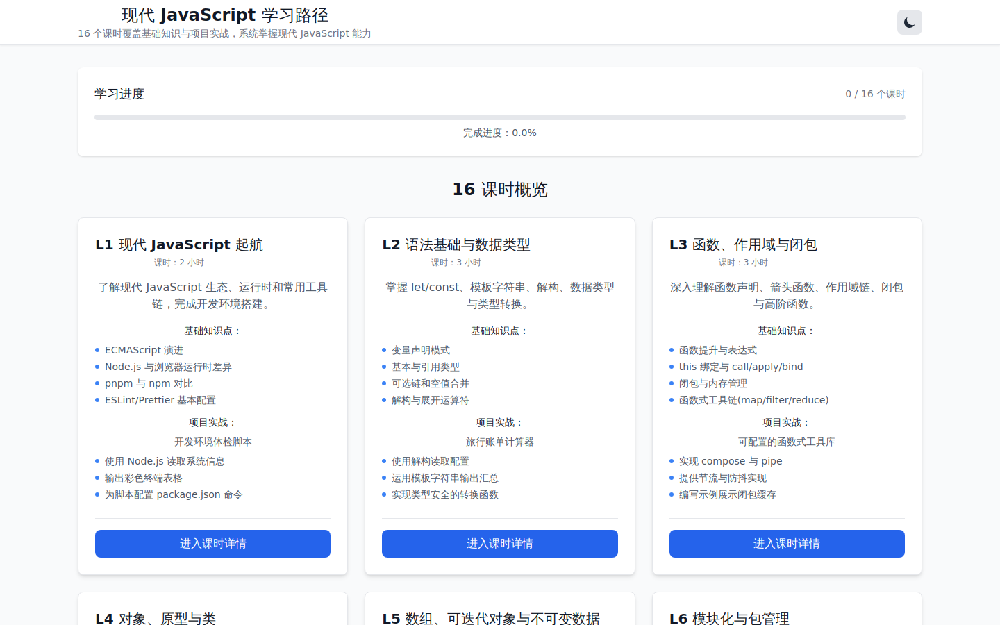
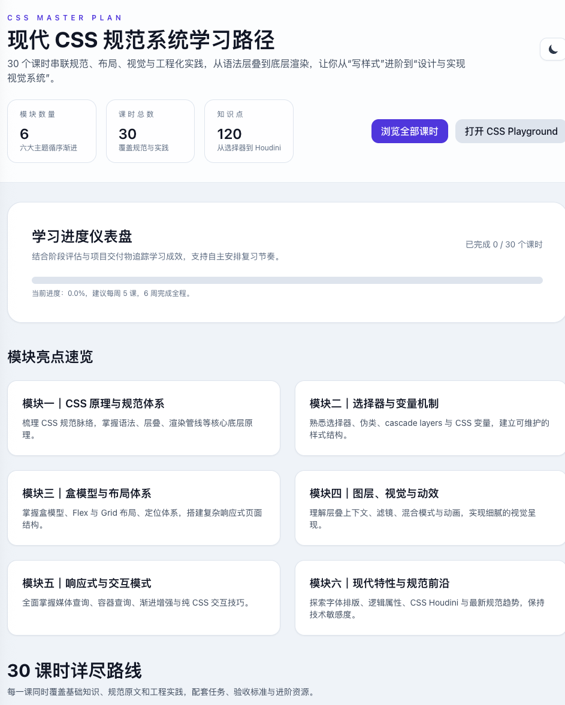
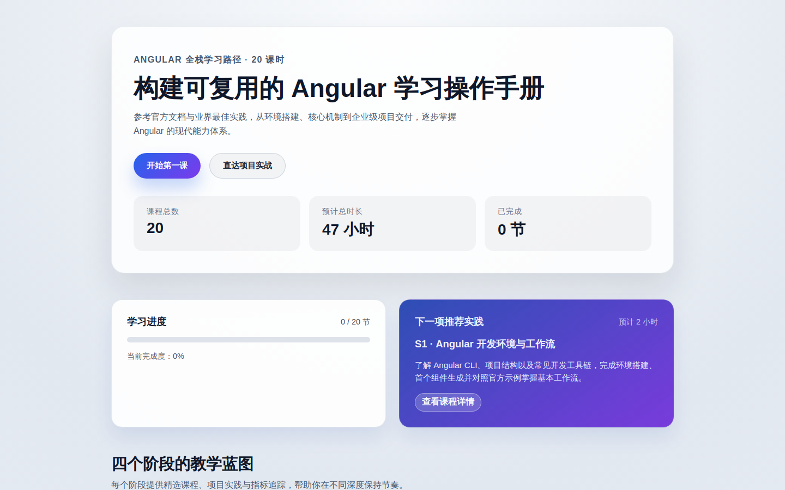
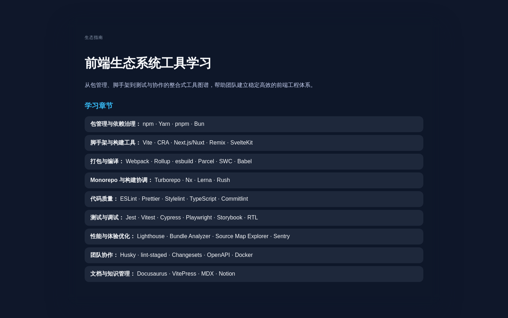

# front-learn

AI Vibing Code 的前端学习项目集合。仓库收录了 React、TypeScript、JavaScript、CSS、Angular 以及工程化工具等多个专题的交互式学习站点与文档，总结了学习路径、项目实践与质量保障方法。

## 📂 仓库导航

| 目录 | 学习主题 | 技术栈 | 快速入口 |
| --- | --- | --- | --- |
| [`react-ts-learning/`](react-ts-learning/README.md) | React + TypeScript 全流程实战 | React 19、TypeScript、Vite、TanStack Query、Zustand、Tailwind CSS | `pnpm install && pnpm dev` |
| [`modern-typescript-learning/`](modern-typescript-learning/README.md) | 现代 TypeScript 16 课课程 | React 19、TypeScript、Vite、Zustand、TanStack Query、Tailwind CSS | `pnpm install && pnpm dev` |
| [`modern-javascript-learning/`](modern-javascript-learning/README.md) | 现代 JavaScript 16 课课程 | React 19、Vite、Tailwind CSS | `pnpm install && pnpm dev` |
| [`css-learning/`](css-learning/README.md) | 现代 CSS 30 课课程与 Playground | React 19、Vite、Tailwind CSS、Prism | `pnpm install && pnpm dev` |
| [`angular-learning/`](angular-learning/README.md) | Angular 全链路 20 课路线 | Angular 17 Standalone、Signals、SCSS | `pnpm install && pnpm dev` |
| [`frontend-ecosystem-tools-learning/`](frontend-ecosystem-tools-learning/README.md) | 前端生态工具指南 | 文档汇总 | 阅读文档 |

---

## 📚 项目详情

### React + TypeScript 学习路线（`react-ts-learning/`）



**定位与亮点**

- 以 12 个阶段带你完成从项目初始化到部署上线的 React + TypeScript 实战路线。
- 首页提供阶段化卡片、学习进度与练习建议，课程详情页覆盖知识点、练习任务、验收标准与扩展阅读。
- 集成 TanStack Query、React Hook Form、Zustand、Vitest 等工具，形成工程化闭环。

**快速开始**

```bash
cd react-ts-learning
pnpm install
pnpm dev --host
```

**阶段大纲**

| 阶段 | 主题 | 核心能力 | 实战任务 |
| --- | --- | --- | --- |
| S0 | 基础起步 | Vite 项目初始化、JSX、Props/State | Counter & TodoList |
| S1 | Hooks 核心 | `useState`、`useEffect`、`useRef`、`useMemo`、`useCallback` | 搜索防抖与输入比较 |
| S2 | 事件与表单 | ChangeEvent、受控组件、表单验证 | 登录表单 + 校验 |
| S3 | 路由 | React Router 路由配置、嵌套路由、懒加载 | Dashboard/Users/Settings 路由体系 |
| S4 | 数据获取 | Axios、React Query、缓存策略 | 用户列表分页与更新 |
| S5 | 全局状态 | Context、Zustand/Redux、状态同步 | 主题切换与用户信息 |
| S6 | 表单进阶 | React Hook Form、Zod Schema | 用户问卷与校验流程 |
| S7 | 样式体系 | CSS Modules/Tailwind/Shadcn | 主题体系与组件库落地 |
| S8 | 测试 | Vitest、Testing Library、组件测试 | Button/Form/List 单元测试 |
| S9 | 性能与可访问性 | Lazy/Suspense、性能调优、a11y 基线 | 指标仪表盘与可访问性审计 |
| S10 | 部署与 CI | Vercel、GitHub Actions、CICD 流程 | Capstone 部署脚本 |
| S11 | 进阶路径 | Next.js、App Router、SSR、Server Components | Dashboard SSR 迁移方案 |

> 更多细节请查看 [`react-ts-learning/README.md`](react-ts-learning/README.md)。

---

### 现代 TypeScript 课程（`modern-typescript-learning/`）



**定位与亮点**

- 以 TypeScript 类型系统为核心，结合 React 组件、后端类型、安全约束与构建工具的 16 课课程。
- 支持任务打卡、示例代码、练习题与进阶挑战，强调类型驱动开发的工程实践。

**快速开始**

```bash
cd modern-typescript-learning
pnpm install
pnpm dev --host
```

**课时大纲**

| 课时 | 主题 | 核心知识点 | 实战/作业 |
| --- | --- | --- | --- |
| L0 | TypeScript 起源与生态 | TS 背景、路线图、痛点分析 | 梳理团队痛点与官方路线图 |
| L1 | 工具链初体验 | `tsc`、`tsconfig`、编译目标 | 初始化 `Hello TS` 与编译日志 |
| L2 | 基础类型与推断 | 基本类型、字面量类型、严格模式 | 重构表单校验脚本 |
| L3 | 函数与 this | 函数签名、重载、`this` 参数 | 事件委托工具函数类型设计 |
| L4 | 接口与类型别名 | interface vs type、交叉类型 | 建模用户领域模型 |
| L5 | 面向对象与装饰器 | 类成员修饰、抽象类、装饰器提案 | 封装请求层服务 |
| L6 | 泛型基础 | 泛型函数、约束、默认值 | 仓储工具库接口设计 |
| L7 | 泛型进阶 | 条件类型、映射类型、`infer` | API 响应类型提取工具 |
| L8 | 模块化与声明组织 | ES 模块、模块解析、类型目录规划 | 拆分公共类型包 |
| L9 | 类型守卫与控制流 | 类型谓词、可辨识联合、控制流分析 | 表单状态机类型守卫 |
| L10 | 异步与并发类型 | Promise、`Awaited`、流式类型 | 批处理调度器类型定义 |
| L11 | 声明文件与第三方库 | DefinitelyTyped、`d.ts` 编写 | 为未提供类型的 SDK 写声明 |
| L12 | React + TS 组件模式 | Props 泛型、事件类型、Hook 类型 | 响应式面板组件 |
| L13 | Node.js 与后端类型 | 接口契约、Zod + TS、依赖注入 | REST API 类型契约与服务 |
| L14 | 构建工具与工程集成 | ESLint、tsup、路径别名 | 输出 ESM/CJS 双版本包 |
| L15 | Capstone 类型驱动迭代 | 类型驱动开发、CI 校验 | 完成端到端小型产品迭代 |

> 更多细节请查看 [`modern-typescript-learning/README.md`](modern-typescript-learning/README.md)。

---

### 现代 JavaScript 课程（`modern-javascript-learning/`）



**定位与亮点**

- 针对现代 JavaScript 的 16 节互动课程，从语法、异步、工程化到性能监控全覆盖。
- 提供课时卡片、进度追踪与项目化练习，帮助从语言基础过渡到交付完整前端应用。

**快速开始**

```bash
cd modern-javascript-learning
pnpm install
pnpm dev --host
```

**课时大纲**

| 课时 | 主题 | 基础知识 | 项目实战 |
| --- | --- | --- | --- |
| L1 | 起航 | ECMAScript 演进、Node vs 浏览器 | 开发环境体检脚本 |
| L2 | 语法与数据类型 | `let/const`、解构、类型转换 | 旅行账单计算器 |
| L3 | 函数与闭包 | 函数提升、`this`、闭包 | 函数式工具库 |
| L4 | 对象与原型 | 原型链、`class`、Proxy | 插件化日志系统 |
| L5 | 数组与迭代 | Array API、迭代器、不可变数据 | 数据可视化准备器 |
| L6 | 模块化与包管理 | ES Modules、workspace | 模块化工具集合 |
| L7 | DOM 与组件化 | 事件模型、Web Components | 无框架组件库雏形 |
| L8 | 异步编程基础 | 事件循环、Promise 组合 | API 稳定器 |
| L9 | Async/Await 与数据流 | `AbortController`、并发控制 | 数据同步服务 |
| L10 | 错误处理与调试 | Error 类型、Source Map | 浏览器调试助手 |
| L11 | 浏览器存储 | IndexedDB、Service Worker | 离线阅读器 |
| L12 | 构建工具与 Vite | HMR、环境变量、bundle 分析 | Vite 企业脚手架 |
| L13 | 质量保障 | ESLint、Prettier、TS 渐进式接入 | 质量基线工程 |
| L14 | 自动化测试 | Vitest、覆盖率策略 | 测试蓝图 |
| L15 | 性能优化与监控 | Core Web Vitals、懒加载 | 性能体检实验室 |
| L16 | 终极实战 | 项目规划、CI/CD、可观测性 | 现代知识管理应用 |

> 更多细节请查看 [`modern-javascript-learning/README.md`](modern-javascript-learning/README.md)。

---

### 现代 CSS 课程（`css-learning/`）



**定位与亮点**

- 30 节课覆盖规范阅读、布局体系、视觉动效与 CSS Playground 动手实验。
- 首页整合模块卡片、进度仪表盘和学习资源，课程详情囊括知识点、项目实践、验收标准与进阶资料。

**快速开始**

```bash
cd css-learning
pnpm install
pnpm dev --host
```

**模块大纲**

| 模块 | 课时范围 | 核心主题 | 代表项目 |
| --- | --- | --- | --- |
| 模块一 | L1-L4 | CSS 规范体系、语法、层叠与渲染流程 | Flexbox 草案阅读、层叠冲突实验 |
| 模块二 | L5-L9 | 选择器、伪类、Cascade Layers、CSS 变量 | 数据表格美化、主题控制台 |
| 模块三 | L10-L15 | 盒模型、Formatting Context、定位、Flex/Grid | 响应式导航与图像画廊 |
| 模块四 | L16-L19 | 视觉表现：背景、滤镜、渐变、层叠上下文 | 多背景卡片、毛玻璃导航 |
| 模块五 | L20-L25 | 过渡与动画、响应式、容器查询、渐进增强 | 动效性能体检、容器查询卡片 |
| 模块六 | L26-L30 | 字体与排版、新单位、Houdini、规范前沿 | 多语言排版、Houdini 渐变绘制 |

> 更多细节请查看 [`css-learning/README.md`](css-learning/README.md)。

---

### Angular 全栈路线（`angular-learning/`）



**定位与亮点**

- 20 节课围绕 Angular 17 Standalone + Signals 构建学习平台，提供阶段化卡片、课程详情与学习进度持久化。
- 覆盖组件通信、表单、HttpClient、RxJS、可访问性、测试与 CI/CD。

**快速开始**

```bash
cd angular-learning
pnpm install
pnpm dev --host
```

**阶段大纲**

| 阶段 | 课时范围 | 能力定位 | 核心焦点 |
| --- | --- | --- | --- |
| S0 启动 | S1-S3 | 建立 Angular 工具链与 Standalone 架构 | 环境搭建、TypeScript、组件分层 |
| S1 核心 | S4-S10 | 模板、通信、表单、HttpClient、Signals | 数据绑定、依赖注入、状态驱动界面 |
| S2 进阶 | S11-S16 | 可维护性与性能优化 | RxJS、可访问性、测试、性能调优 |
| S3 实战 | S17-S20 | 企业级项目交付 | PRD 拆解、CI/CD、部署与监控 |

> 更多细节请查看 [`angular-learning/README.md`](angular-learning/README.md)。

---

### 前端生态工具指南（`frontend-ecosystem-tools-learning/`）



**定位与亮点**

- 总结包管理、脚手架、构建打包、Monorepo、代码质量、测试调试、性能监控、协作流程与文档知识库等工具。
- 每个章节给出实践建议与官方文档链接，可作为团队工程能力的随身手册。

**核心章节**

- **包管理与依赖治理**：npm、Yarn、pnpm、Bun 的优势与适用场景。
- **脚手架与构建工具**：Vite、CRA、Next.js/Nuxt、Remix、SvelteKit。
- **打包与编译**：Webpack、Rollup、esbuild、Parcel、SWC、Babel。
- **Monorepo 与构建协调**：Turborepo、Nx、Lerna、Rush。
- **代码质量**：ESLint、Prettier、Stylelint、TypeScript、Commitlint。
- **测试与调试**：Jest、Vitest、Cypress、Playwright、Storybook、RTL。
- **性能与体验优化**：Lighthouse、Bundle Analyzer、Source Map Explorer、Sentry。
- **团队协作**：Husky、lint-staged、Changesets、OpenAPI、Docker。
- **文档与知识管理**：Docusaurus、VitePress、MDX、Notion。

> 文档全文位于 [`frontend-ecosystem-tools-learning/README.md`](frontend-ecosystem-tools-learning/README.md)。

---

## 🖼️ 截图文件

所有首页截图保存在 [`screenshots/`](screenshots) 目录，可在 Markdown 中复用或导出到其他文档。
